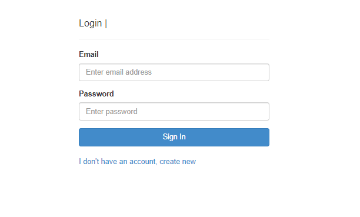
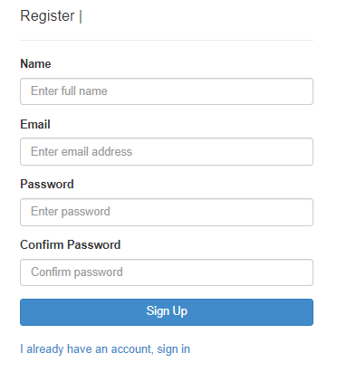
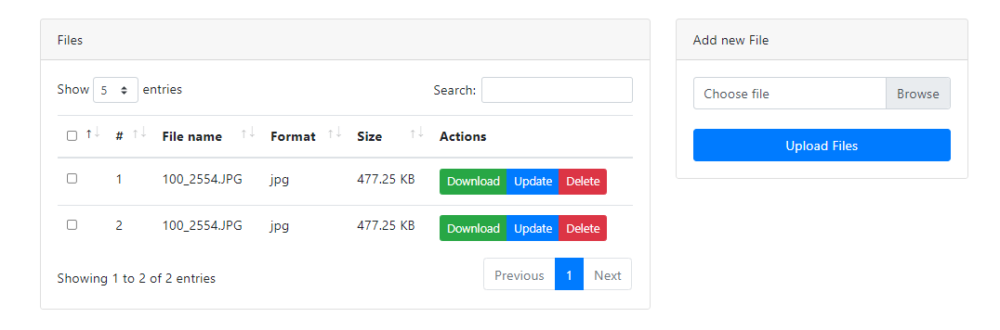

## File Storage
File storage is web application that allows user to:
* Register / Signup
* Login
* Upload File
* Rename File
* Download File
* Delete File / Files

### How to run
**Prerequisite:**
Docker should be installed to run this project
* Clone this repository 
* `cd file_storage`
* `docker-compose up -d`
* `docker exec -it file-storage bash`
* `composer install`
* `php artisan migrate`
* Navigate to http://localhost:8000

### Validations
* Supported file formats are: png, jpg, jpeg, csv, txt, xlx, xls, pdf
* Max upload file size is 8 mb
* Frontend and backend validations
* Check if file actually belongs to logged in user before deleting
* Session management with custom middleware

### Comment 
I have coded custom login / registration instead of using builtin laravel authentication.

### Screenshots
#### Login

#### Register

#### Dashboard

